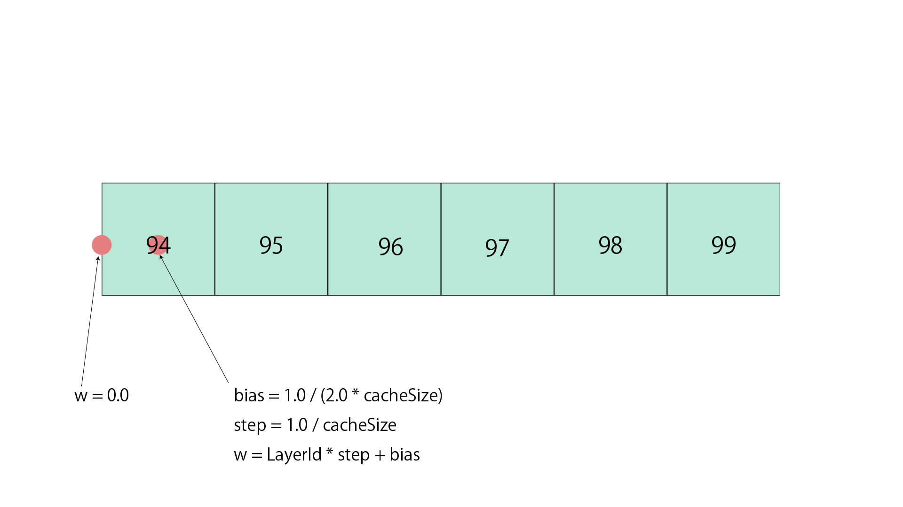

# using Texture3D and Texture Array in GLSL

## Rederence 
- [WebGL 2.0 - TEXTURE_3Dでボリュームレンダリング表現を行う](https://ics.media/web3d-maniacs/webgl2_texture3d/ "WebGL 2.0 - TEXTURE_3Dでボリュームレンダリング表現を行")
- [learnGLSL Touchdesigner](https://github.com/raganmd/learningGLSL, "learnGLSL Touchdesigner")

## Hint
